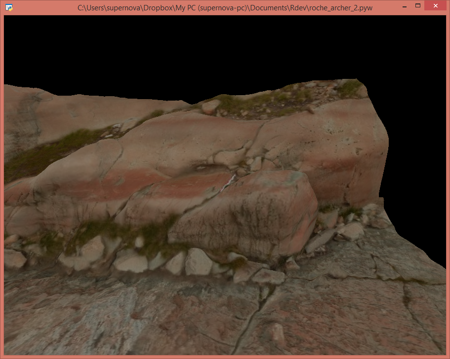

# Rdev
> Test Files for R and Python

## 'Roche de l'archer' 3D photogrammetry model

A piece of rock-art from the Mont Bego archaeological site. This GitHub repository stores these different files

* `roche_archer_2` + `.obj` + `.mlt` + `.jpg` : files coming from the rock-art low-resolution photogrammetric model (Wavefront Stanford object). [See it on Sketchlab](https://sketchfab.com/3d-models/roche-archer-2-a5c0771d898d4816950570cd7fb1be37).

* [`roche_archer_2` + `.pyw`](https://github.com/zoometh/Rdev/blob/master/roche_archer_2.pyw) : a Python 3 code script inspired by [this GitHub document](https://github.com/pywavefront/PyWavefront/blob/master/examples/globe_simple.py). This script allows to: 

  + read the photogrammetric model
  
  + create a rotation view in a RGL window
  

 

 

