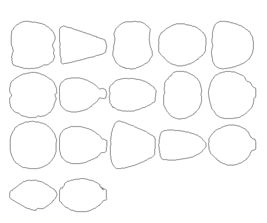
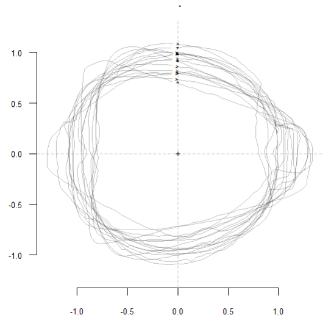
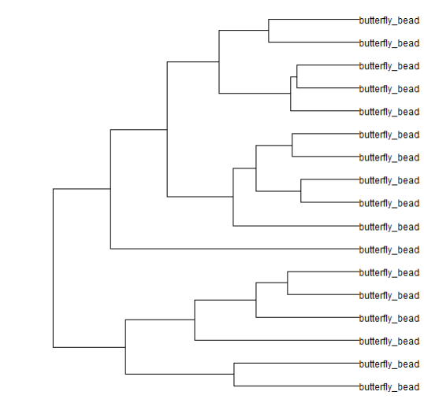
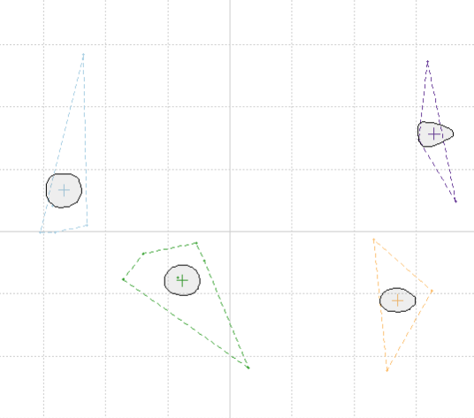

# GMM
> Geometry Morphometry with the Momocs package

## Extract lithics from photographs

Use [ImageMagick](https://imagemagick.org/) processes, in a [Python script](https://github.com/zoometh/Rdev/blob/master/gmm/extract_lithics_4.py), to extract flints from standardized photographs:


<p align="center">
  
</p>

<p align="center">
:arrow_down:
</p>

<p align="center">
  
</p>


1. Read a XLSX file ([download](https://github.com/zoometh/Rdev/raw/master/gmm/inventary.xlsx)) to recover folder names and photographs filenames
2. Compute several ImageMagick operations (thresholds, connected-components, etc.)
3. Write a black and white image of the lithic with the same filename of the original photo + suffix '`_shape`'

The black and white JPG image is ready to be used for GMM processes

---

## Sickles

R Script for the shape analysis and classification of sickles blades

<p align="center">
  
  <br>
    <em>Kmeans on 225 sickles, with 6 centers (ie, clusters)</em>
</p>

---

## Arrowheads

R Script for a demo showing the shape analysis and classification of arrowheads. The original dataset and part of the code comes from: 
 - Matzig, D. N., Hussain, S. T., & Riede, F. (**2021**). "Design Space Constraints and the Cultural Taxonomy of European Final Palaeolithic Large Tanged Points: A Comparison of Typological, Landmark-Based and Whole-Outline Geometric Morphometric Approaches". *Journal of Paleolithic Archaeology*, 4(4), 1-39, doi: https://doi.org/10.5281/zenodo.4560743
 
 ---
   
 ## Beads
> R tutorial for butterfly beads. 

Download the content of the https://github.com/zoometh/Rdev/tree/master/gmm/out folder with https://download-directory.github.io/ and run:
 
```
library(Momocs)
library(dplyr)

outpath <- paste0(getwd(), "/gmm/out")
```

Here, you have to change the `outpath` to the path of your folder. Start the shape analysis:

```
lf <- list.files(outpath, full.names = TRUE)
coo <- import_jpg(lf)
beads <- Out(coo)
beads.f <- efourier(beads)
```

`beads` is a `"Out" "Coo"` Momocs' object and `beads.f` is a `"OutCoe" "Coe"` Momocs' object (Fourier). Now, show the beads in a panel:

```
beads %>%
  panel()
```

<p align="center">
  
  <br>
    <em>Panel</em>
</p>

Show them in a standardized stack:

```
beads %>%
  coo_center %>%
  coo_scale %>%
  coo_slidedirection("up") %T>%
  print() %>%
  stack()
```

<p align="center">
  
  <br>
    <em>Stack (centered-scaled)</em>
</p>


See their clustering

```
beads.p <- CLUST(beads.f)
plot(beads.p)
```

<p align="center">
  
  <br>
    <em>Clustering</em>
</p>


And show their Kmeans

```
beads.p <- PCA(beads.f)
KMEANS(beads.p, centers = 4)
```

<p align="center">
  
  <br>
    <em>Kmeans</em>
</p>


