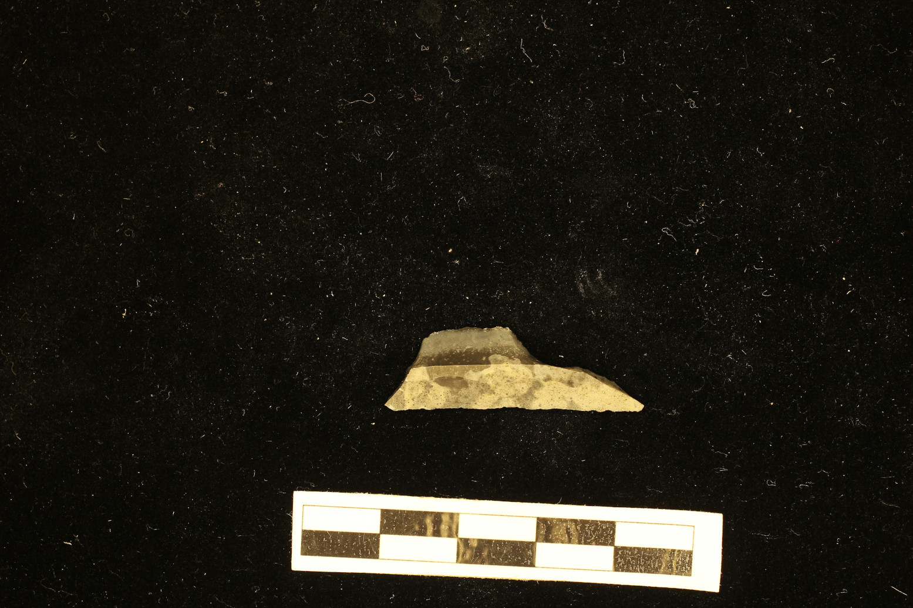
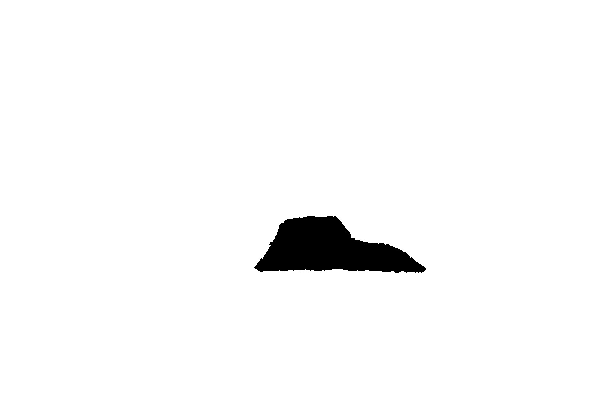

# GMM
> Geometry Morphometry with the Momocs package

## Extract lithics from photographs

  

:arrow_down:

  

Use [ImageMagick](https://imagemagick.org/) processes, in a Python loop, to extract flints from standardized photographs:

1. Read a XLSX file ([download](https://github.com/zoometh/Rdev/raw/master/gmm/inventary.xlsx)) to recover folder names and photographs filenames
2. Compute several ImageMagick operations (thresholds, connected-components, etc.)
3. Write a black and white image of the lithic with the same filename of the original photo + suffix '`_shape`'

The black and white JPG image is ready to be used for GMM processes

---

## Sickles

R Script for the shape analysis and classification of sickles blades

  
   
    <em>Kmeans on 225 sickles, with 6 centers (ie, clusters)</em>

---

## Arrowheads

R Script for a demo showing the shape analysis and classification of arrowheads. The original dataset and part of the code comes from: 
 - Matzig, D. N., Hussain, S. T., & Riede, F. (**2021**). "Design Space Constraints and the Cultural Taxonomy of European Final Palaeolithic Large Tanged Points: A Comparison of Typological, Landmark-Based and Whole-Outline Geometric Morphometric Approaches". *Journal of Paleolithic Archaeology*, 4(4), 1-39, doi: https://doi.org/10.5281/zenodo.4560743

