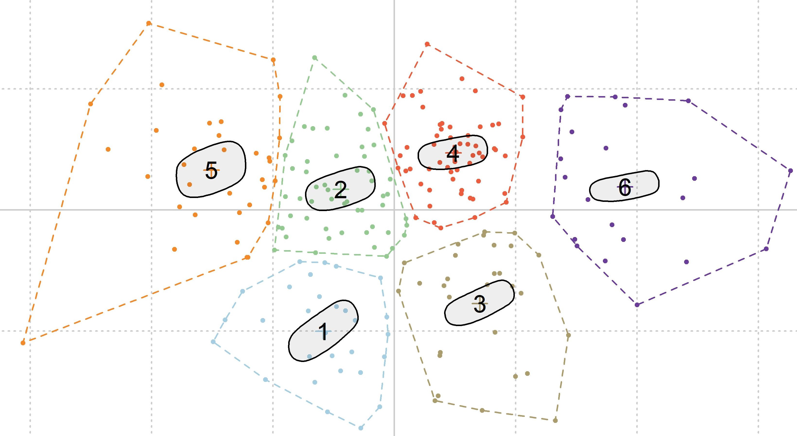

# GMM
> Geometry Morphometry with the Momocs package

  
   
    <em>snapshot from the RGL window generated from the Python script</em>

---

## Extract lithics from photographs

Use [ImageMagick](https://imagemagick.org/) processes in a Python loop to extract flints from standardized photographs:

1. Read a XLSX file to recover folder names and photographs filenames
2. Compute several ImageMagick operations (filter, thresholds, etc.)
3. Write a black and white image of the lithic with the same filename of the original photo + suffix `_shape`

The black and white image is ready to be used for GMM processes

---

## Sickles

R Script for the shape analysis and classification of sickles blades

