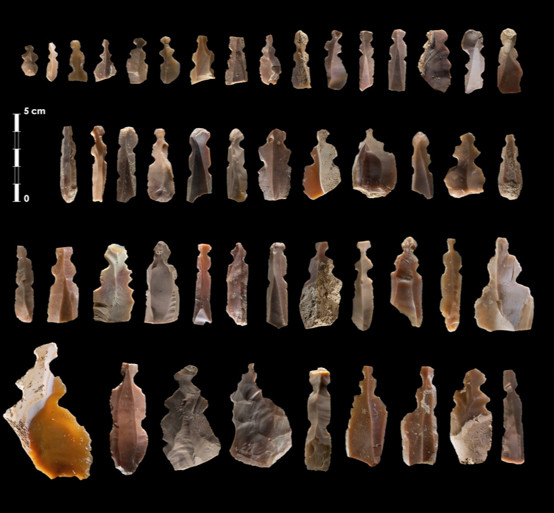
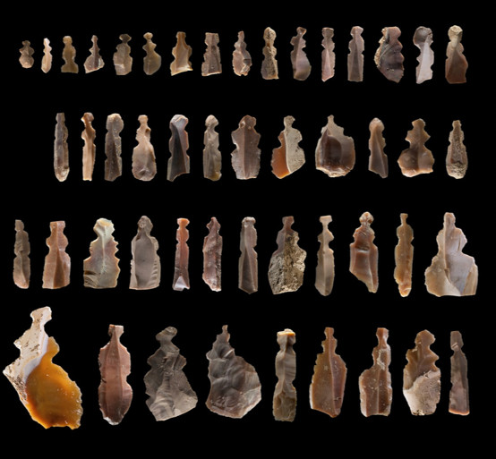
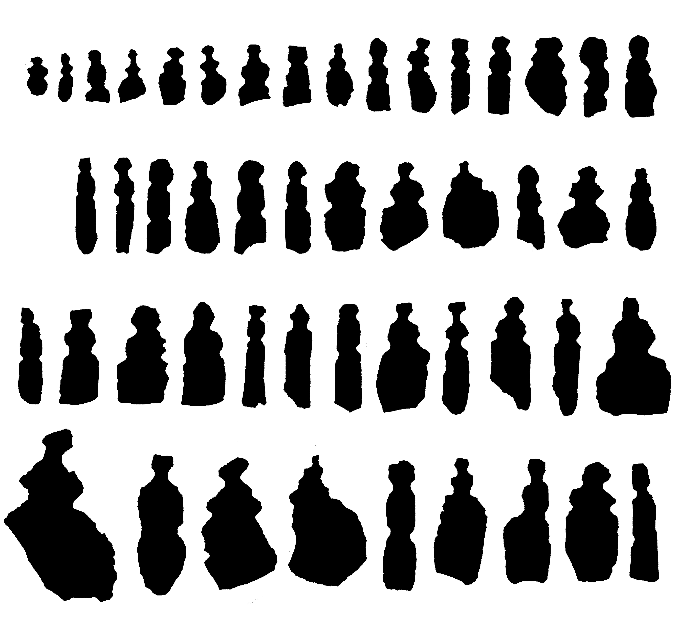
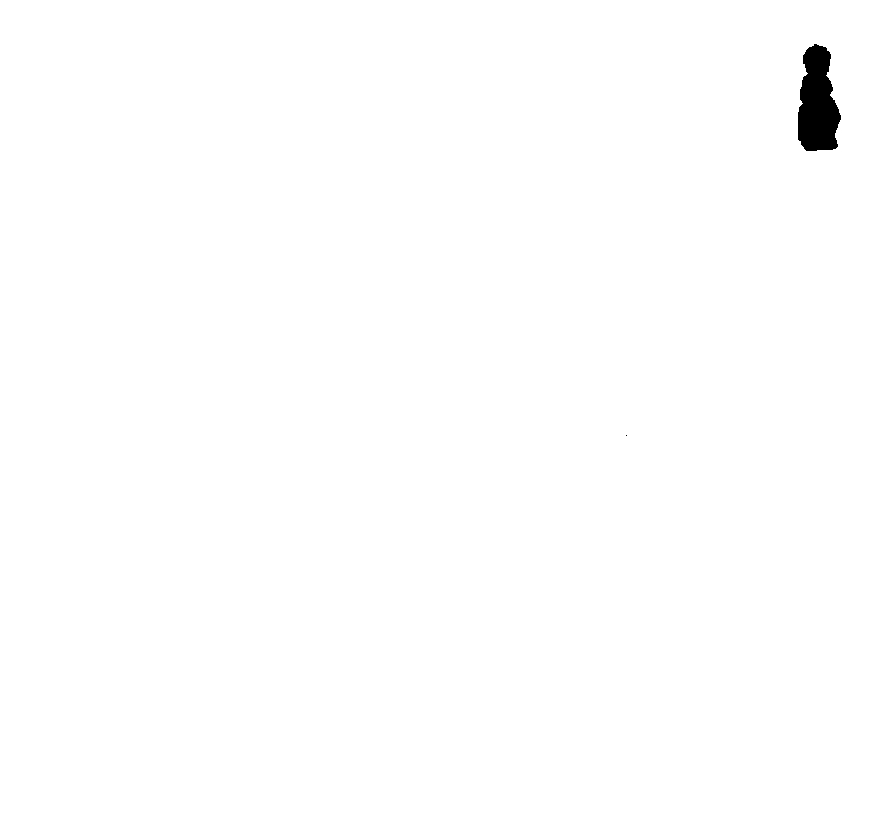

# Kharaysin

Original photograph:



Remove the scale:



Convert to B/W:



Run [kharaysin.R](https://github.com/zoometh/Rdev/blob/master/gmm/kharaysin/kharaysin.R):

```R
# remotes::install_github("zoometh/outlineR")
library(outlineR)

sampling <- T

setwd(dirname(rstudioapi::getSourceEditorContext()$path))

inpath <- "./img/input_data"
jpgs <- "./img/out"

separate_single_artefacts(inpath = inpath,
                          outpath = jpgs)
```

Will creates individual objects



Run [crop.py](https://github.com/zoometh/Rdev/blob/master/gmm/kharaysin/crop.py):

```Python
py "C:\Rprojects\Rdev\gmm\kharaysin\crop.py"
```

Will crop the individual images


Open all the individual images in QGIS


