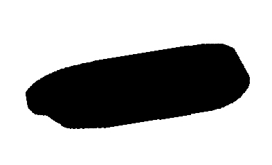
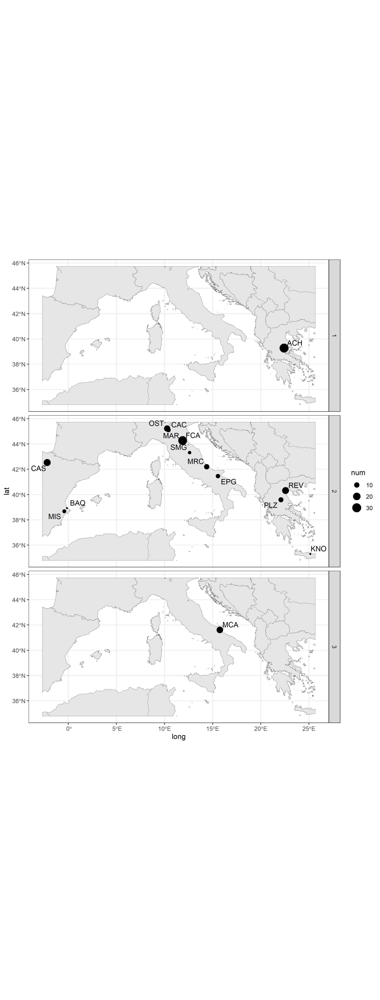

# Sickles

  
  
  
  
  
  
  
  
   
  <em>A selection of the dataset (n = 50)</em>

## Lithics

On individual lithics

### Panel

   
  <em>Panel on lithics, colored according to their archaeological site</em>

### Stack

   
  <em>Stack on lithics</em>

### PCA

   
  <em>PCA on lithics</em>

### HC

   
  <em>HC on lithics</em>

### Kmeans

   
  <em>Kmeans on lithics</em>

### Spatial

   
  <em>Map of lithics</em>

## Sites

On grouped lithics by sites
### CA on sites

   
  <em>CA on sites</em>

### HC on sites

   
  <em>HC on sites</em>

### Map of clustered sites

   
  <em>HC map</em>

