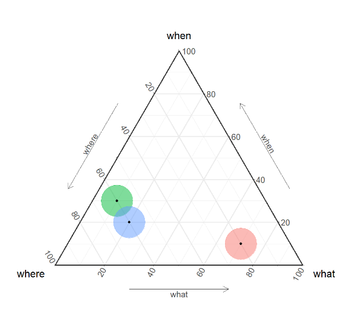

# HOUSEPROD

## Data management and analysis

Archaeological data of Minferri, Cantorella and Els Villars will be managed with the same worflow to ensure that quantitative comparisons (statistics) will be made possible. The three main dimesnions of analysis will be the time-related, the space-related and the typo-related information. These registers will be documented by different specialists. The purpose of the data management work is to ensure the matching between these three registers within a same and easily reproductible workflow without losing any informations. To do so, a unique ID will be assigned to structures, archaeological layers and artefacts.

record example:

| site ID | structure ID | layer ID | artefact ID | unique record ID |
|----------|----------|----------|----------|----------|
| MIN   | sitge 1   | capa 1   | 1001   | MIN-1-1-1001   |

We will favor tabular structures, like the basic XLSX (Excel) worksheet because they are light weight documents that most archaeologists and specialist know how to manipulate them (sorting, filtering, aggreagating). The inerpoation of the information scattered over these files will be done using the "unique record ID". We might developp an R function (programming) to match the data and run statistics since R is the most common scripting language in archaeology.

Statistical analysis will cover (in this order): descriptive (histograms, pie charts, boxplots, etc.), exploratory (Factorial Analysis, Mixed- or Multi-factor Analysis, Hierachical Clustering, etc.) and confirmatory analysis (statistical tests: Multiple Kruskal-Wallis, Khi-Square, etc.). These statistics will be conduct to assess the probability that archaeological features belong to the same archaeological event.

Matrices of distances (ie, dis-similarities) will be calculated over these three dimensions and finally these matrices will be merged into one matrix (matrices integration) that will sumup the similarities and dissimilarities over the artefacts, the layers, the structures and finaly the sites (multi-scalar) though agglomeration of data and bottom-up clustering.

### Time

This is the "When" dimension. The time-related information will be managed within the package "WP: Radiocarbon dating: building precise chronologies and phasing". Radiocarbon dates will be collected over the numerous structures (*sitges*: pits, and cabans) of Minferri to provide absolute dates that can help to cross-date the archaeological material found within the archaeological layers ("is contemporain with"), or help to constraint chronological relationships with above and below layers (respectively: "after" and "after"). Bayesian analysis will improve the date modeling. Stratigraphy and age-depth models will be used to assess non-directly dated layers. Radiocarbon calibrations, modelling and bayesian analysis are thought to be managed using the open-access software OxCal maintained by the University of Oxford.

### Space

This is the "Where" dimension. The spatial distribution of the time-related information will be managed using a GIS, using Geographic model such as topo-seriation. Minferri and Cantorella have scattered structures. Els Vilars has also elevations. Their ground plan and elevations (ie, map) will be digitalised in a GIS. For the latter, We will favor an open-source GIS (ex: QGIS) and open format (ex: Well-Known Text, WKT) to ensure the compliance of the geographical information and its reusability (FAIR policies). 

### Typology

This is the "What" dimension. It covers lithic or ceramic typology and technology, but also faunal and botanical assemblages (a set of different artefacts), structure shapes, etc. are commonly used to assess archaeological cultures. This is really the part where the projects specialists will apply their expertise. Even if this are heteroclit data, archaeologists from any specialities are used to sum their assessment in types: a grouping of features that share more in common than they share with other groups. For the modelling, we will use these different types as the basic values to compute the overall statistics.

