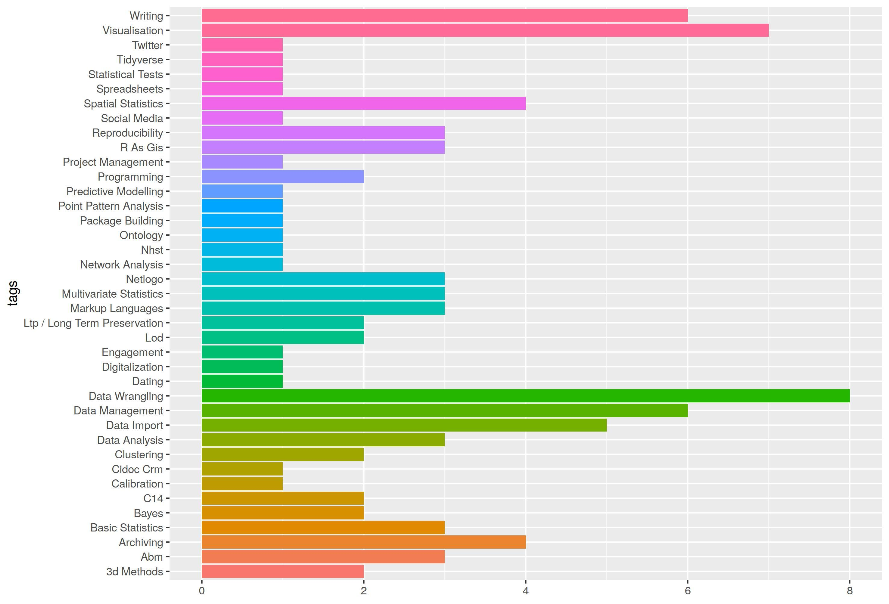

## SSLA material for teaching

This code runs a visualisation on the tags used in the teaching materials list of the Special Interest Group Scientific Scripting Languages in Archaeology of the CAA, cf. https://sslarch.github.io/

