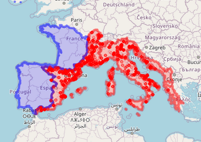

# Time modeling
>  "*Le temps, c'est ce qui passe quand rien ne se passe*" (J. Giono) 

## Radiocarbon and dendrochronological data integration and visualization
> [webpage](https://neolithic.shinyapps.io/AbsoluteDating/)

Radiocarbon (14C) and dendrochronological dates are one of the most sharable world-wide data. Their integration in online database, their management, and their modeling represent a classic playground in computing archaeology

## **NeoNet** Neolithisation of the central and western Mediterranean
> [app](https://neolithic.shinyapps.io/NeoNet/)  
> [webpage](https://zoometh.github.io/C14/neonet)

We developed a RShiny app for interactive selection, mapping and calibration for the Mesolithic/Neolithic transition (8000 - 5000 BP uncal) in North-Central and North-Western Mediterranean watersheds (in red)

  
   
    <em>[A view of the NeoNet dataset](https://zoometh.github.io/C14/watersheds.html)</em>

  
The canvas of this RShiny app is inspired by the [Euroevol database](http://discovery.ucl.ac.uk/1469811/) database. Following this canvas, we aim to integrate dates from other watersheds: South Atlantic Europe (here in blue), Aegean Sea, etc.

