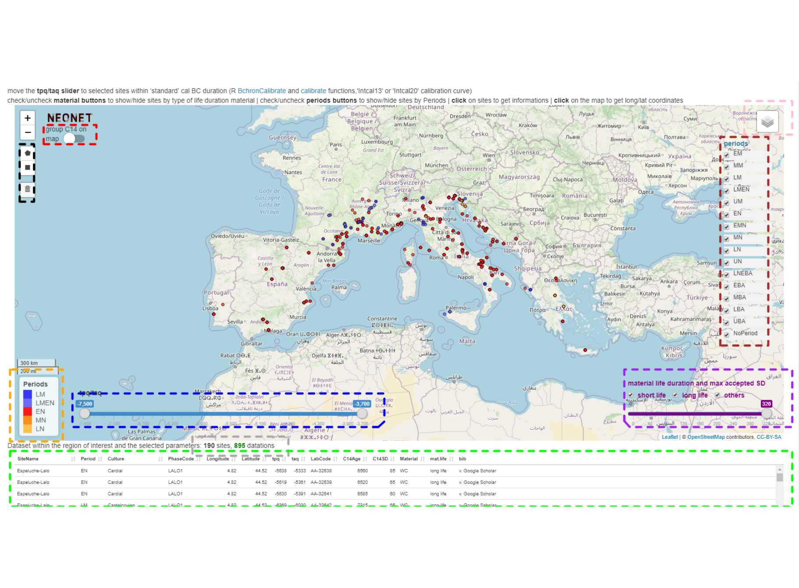

<style>
.html-widget {
margin: auto;
}
</style>


``{=html}

<style type="text/css">
caption {
  color: grey;
  # font-weight: bold;
  # font-size:small; # not working (15px, large)
}
</style>
  

<div class="figure" style="text-align: center">

<p class="caption">(\#fig:previewroi)Preview of the current [NeoNet C14 dates dataset](#panel.data), in red, covering the Late Mesolithic/Early Neolithic transition of the North Central-Western Mediterranean watershed</p>
</div>


<!-- The NeoNet app is part of the [Time modeling project](https://github.com/zoometh/C14#time-modeling) -->


# **Presentation**

The [**NeoNet app**](http://shinyserver.cfs.unipi.it:3838/neonet/app/) aims to contribute to the study the pioneering front of the farming live-style (i.e., Neolithic) by focusing our study on the mobile border between the Last Hunter-Gathers economy and the Early Neolithic (ca. 7,000 BC to 3,500 BC) in the Central and Western Mediterranean. The interactive web app facilitates the selection of absolute dates (c14 dates) by providing selection tools for:

* spatial
  + geographical region of interest (ROI)
  + custom selection shape inside the ROI

* chronology 
  + date time span between a *tpq* and a *taq* in cal BC
  + main periods (Middle Mesolithic, Late Mesolithic, Early Neolithic, ...)

* date accuracy
  + some type of material life duration (short like, long life or others)
  + threshold of the maximum accepted standard deviation (SD)

<!-- and more precisely the Mediterranean watersheds of this area -->

<!-- <p style="text-align: center;"> -->
<!-- /Documents/C14/docs/imgs/ws_roi.png){width=35%} -->
<!-- </p> -->

This static website is a tutorial for the RShiny [**NeoNet app**](http://shinyserver.cfs.unipi.it:3838/neonet/app/). Both have been generated with R, from a perspective of FAIR Science and collaborative working. The app has been developed in the frame of the [NeoNet work group](https://redneonet.com). We will see [how it works](#app), what is the format [dataset](#bd) and what are our [objectives](#particip)

# **NeoNet app** {#app}

The app is a [RShiny](https://shiny.rstudio.com/) hosted on the [**Università di Pisa**](http://shinyserver.cfs.unipi.it:3838/neonet/app/) server. The app is divided into five (5) panels:

1. [**map** panel](#panel.map): spatial filtering with selection menus on dates
2. [**calib** panel](#panel.calib): calibration of the selected dates
3. [**data** panel](#panel.data): the whole dataset
4. [**biblio** panel](#panel.biblio): bibliographical references
5. [**infos** panel](#panel.infos): credits and link to the webpage handbook of the app

## 1. **map** panel {#panel.map}
/Documents/C14/docs/imgs/panel_map_idx.png){width=25%}

The panel **map** is a geographical window provided by the [Leaflet](https://rstudio.github.io/leaflet/) package. This panel is used for selection of radiocarbon dates [by location](#panel.map.select.loc), [by chronology](#panel.map.select.chr), [by quality of dates](#panel.map.select.quali). Once selected, dates can be [calibrated](#panel.map.calib)


<div class="figure" style="text-align: center">

<p class="caption">(\#fig:panel-map1)The different menus of the map panel</p>
</div>

The current functions are:

* Fig. \@ref(fig:panel-map1), <span style="color:red"><u>red</u></span> box, top-left button ***group C14 on map***: allows to cluster dates by spatial proximities ([Marker Clusters](http://rstudio.github.io/leaflet/markers.html)) 

* Fig. \@ref(fig:panel-map1), <span style="color:pink"><u>pink</u></span> box, top-right layer button: allows to change the basemap. By default, the basemap is **OSM**, an [OpenStreetMap general basemap](https://leaflet-extras.github.io/leaflet-providers/preview/#filter=OpenStreetMap.Mapnik), but it can be switch to **Topo**, an [ESRI topographical basemap](https://leaflet-extras.github.io/leaflet-providers/preview/#filter=Esri.WorldImagery)

* Fig. \@ref(fig:panel-map1), <span style="color:darkgrey"><u>grey</u></span> box, bottom inline text: reactive count of selected dates and select sites 

* Fig. \@ref(fig:panel-map1), <span style="color:green"><u>green</u></span> box, bottom table: reactive datatable ([DT package](https://cran.r-project.org/web/packages/DT/index.html)) listing all the dates within the map extent (ROI) and the optional selection menus (tpq/taq, material life duration, maximum SD, periods, selection shapes)

### select by location {#panel.map.select.loc}

By default only the data within the window extent (ROI) will be selected. But selection shapes can be drawn inside this ROI to have a spatial intersection:

Fig. \@ref(fig:panel-map1), <span style="color:black"><u>black</u></span> box, top-left draw toolbar: selection shapes, ***polygons*** and ***rectanges***, can *freeze* the date selection inside a given ROI. They can be removed with the trash button. All the dates inside the ROI and selected with the others filters will be visible on the map, but only those inside the selections shapes will be calibrated  

<center>

/Documents/C14/docs/imgs/panel_map_shape.png){width=700px}

</center>

#### retrieve coordinates from the map {#panel.map.select.loc.get}

As said, the default basemap of the app is OSM. It offers a well documented basemap where archaeological sites are sometimes already located, like the Ligurian site of [Grotta della Pollera](https://www.openstreetmap.org/#map=19/44.20058/8.31466). Clicking on the map show the lat/long coordinates of the current point (under the tpq/tap slider). These coordinates can then be copied and used to modify the NeoNet dataset

<center>

/Documents/C14/docs/imgs/panel_map_coords.png){width=250px}

</center>

### select by chronology {#panel.map.select.chr}

* Fig. \@ref(fig:panel-map1), <span style="color:brown"><u>brown</u></span> box, top-right checkboxes: allow to select dating by periods. The <span style="color:orange"><u>orange</u></span> box, bottom-left legend, is reactive and update depending on selected periods

* Fig. \@ref(fig:panel-map1), <span style="color:blue"><u>blue</u></span> box, bottom-left slider: allows to subset a range of accepted dates between a *tpq* and a *taq* (in cal BC)

### select by dates quality {#panel.map.select.quali}

* Fig. \@ref(fig:panel-map1), <span style="color:purple">purple</span> box, bottom-right checkboxes and slider: a group of menus for selection on the material life duration and max accepted SD:
  + relatively to the duration of their material (short to long-life material)
  + below a maximum accepted threshold for the standard deviations (SD) for the dates

### calibrate one or various dates {#panel.map.calib}

The dates displayed in the [table of the **map panel**](#panel.map) will be calibrate when one of them has been clicked.

<center>

/Documents/C14/docs/imgs/panel_map_select.png){width=250px}

</center>


## 2. **calib** panel {#panel.calib}
/Documents/C14/docs/imgs/panel_calib_idx.png){width=25%}


The panel **calib** is used for analysis. Calibration of selected dates are done on-the-fly with the R package [rcarbon](https://cran.r-project.org/web/packages/rcarbon/index.html). If the dates are numerous (e.g., > 100) **the computing time could take times**, be patient.

<center>


</center>

This date which have been clicked on the [**map panel**](#panel.map.calib) will be shown **bolded** on the output figure

### c14 group by *filter* {#panel.calib.group}

The only selection which can be done is on the top-center radio button  (Fig. \@ref(fig:panel-calib), <span style="color:red"><u>red</u></span> box). The **c14 group by** filter allows to plot dates and to sum their probability densities depending on different levels of grouping:

* **LabCode**: each radiocarbon date is plot separately (by default)

* **SiteName and PhaseCode**: dates from the same site, having the same archaeological unit (layer, structure, etc.), are summed. See the [PhaseCode](#mf.phasecode) field.

* **SiteName and Period**: dates from the same site, having the same period are summed

* **Period**: dates having the same period are summed  

* **All C14**: all dates are summed 

<div class="figure" style="text-align: center">

<p class="caption">(\#fig:panel-calib)The different menus of the calib panel</p>
</div>

### plot area *output*

The plot area (Fig. \@ref(fig:panel-calib), <span style="color:orange"><u>orange</u></span> box) shows dynamically the SPD of the cabibrated dates seriated on their weighted means. The top-right  button **Download** (Fig. \@ref(fig:panel-calib), <span style="color:green"><u>green</u></span> box) allows to export the last plot in a PNG image

<p style="text-align: center;">
/Documents/C14/docs/imgs/neonet_calib_example.png){width=80%}
</p>

## 3. **data** panel {#panel.data}
/Documents/C14/docs/imgs/panel_data_idx.png){width=25%}

The complete dataset from the GitHub  [c14data.tsv](https://github.com/zoometh/C14/blob/main/neonet/c14data.tsv) file (a dataframe with tab-separated values). Today, the dataset counts <span style="color: grey;">2478</span> dates:

<table class="table" style="font-size: 11px; width: auto !important; margin-left: auto; margin-right: auto;">
<caption style="font-size: initial !important;">(\#tab:panel-data)Dates sample</caption>
 <thead>
  <tr>
   <th style="text-align:left;">   </th>
   <th style="text-align:left;"> SiteName </th>
   <th style="text-align:left;"> Country </th>
   <th style="text-align:left;"> Period </th>
   <th style="text-align:left;"> PhaseCode </th>
   <th style="text-align:left;"> LabCode </th>
   <th style="text-align:right;"> C14Age </th>
   <th style="text-align:right;"> C14SD </th>
   <th style="text-align:left;"> Material </th>
   <th style="text-align:left;"> MaterialSpecies </th>
   <th style="text-align:right;"> tpq </th>
   <th style="text-align:right;"> taq </th>
   <th style="text-align:right;"> Longitude </th>
   <th style="text-align:right;"> Latitude </th>
   <th style="text-align:left;"> bib </th>
   <th style="text-align:left;"> bib_url </th>
  </tr>
 </thead>
<tbody>
  <tr>
   <td style="text-align:left;"> 1753 </td>
   <td style="text-align:left;"> Abri de la Font-des-Pigeons </td>
   <td style="text-align:left;"> France </td>
   <td style="text-align:left;"> EN </td>
   <td style="text-align:left;"> Courtin C16-17 </td>
   <td style="text-align:left;"> Ly-2829 </td>
   <td style="text-align:right;"> 6200 </td>
   <td style="text-align:right;"> 100 </td>
   <td style="text-align:left;"> wood charcoal </td>
   <td style="text-align:left;"> Wood charcoal (unidentified) </td>
   <td style="text-align:right;"> -4715 </td>
   <td style="text-align:right;"> -5479 </td>
   <td style="text-align:right;"> 5.166700 </td>
   <td style="text-align:right;"> 43.38340 </td>
   <td style="text-align:left;"> Courtin et al. 1985 </td>
   <td style="text-align:left;"> Courtin85 </td>
  </tr>
  <tr>
   <td style="text-align:left;"> 906 </td>
   <td style="text-align:left;"> Roc du Dourgne </td>
   <td style="text-align:left;"> France </td>
   <td style="text-align:left;"> EN </td>
   <td style="text-align:left;"> C6 </td>
   <td style="text-align:left;"> MC-781 </td>
   <td style="text-align:right;"> 5000 </td>
   <td style="text-align:right;"> 170 </td>
   <td style="text-align:left;"> wood charcoal </td>
   <td style="text-align:left;"> Wood charcoal (unidentified) </td>
   <td style="text-align:right;"> -3030 </td>
   <td style="text-align:right;"> -4438 </td>
   <td style="text-align:right;"> 2.087900 </td>
   <td style="text-align:right;"> 42.76070 </td>
   <td style="text-align:left;"> Perrin &amp; Manen 2021 </td>
   <td style="text-align:left;"> https://doi.org/10.1371/journal.pone.0246964 </td>
  </tr>
  <tr>
   <td style="text-align:left;"> 2341 </td>
   <td style="text-align:left;"> Ca l'Estrada </td>
   <td style="text-align:left;"> Spain </td>
   <td style="text-align:left;"> EN </td>
   <td style="text-align:left;"> SF-501 </td>
   <td style="text-align:left;"> Poz-10391 </td>
   <td style="text-align:right;"> 5740 </td>
   <td style="text-align:right;"> 40 </td>
   <td style="text-align:left;"> bone (human) </td>
   <td style="text-align:left;"> Homo sapiens </td>
   <td style="text-align:right;"> -4368 </td>
   <td style="text-align:right;"> -4787 </td>
   <td style="text-align:right;"> 2.280458 </td>
   <td style="text-align:right;"> 41.62573 </td>
   <td style="text-align:left;"> Ruiz et al. 2012 </td>
   <td style="text-align:left;"> Ruiz12 </td>
  </tr>
  <tr>
   <td style="text-align:left;"> 2096 </td>
   <td style="text-align:left;"> Passo della Comunella </td>
   <td style="text-align:left;"> Italy </td>
   <td style="text-align:left;"> LM </td>
   <td style="text-align:left;"> Isolated charcoal from layers </td>
   <td style="text-align:left;"> Birm-830 </td>
   <td style="text-align:right;"> 6960 </td>
   <td style="text-align:right;"> 130 </td>
   <td style="text-align:left;"> wood charcoal </td>
   <td style="text-align:left;"> Wood charcoal (unidentified) </td>
   <td style="text-align:right;"> -5476 </td>
   <td style="text-align:right;"> -6327 </td>
   <td style="text-align:right;"> 10.312954 </td>
   <td style="text-align:right;"> 44.28050 </td>
   <td style="text-align:left;"> Kozlowski et al. 2003 </td>
   <td style="text-align:left;"> Kozlowski03 </td>
  </tr>
</tbody>
</table>

At first, these data were recorded in an Excel spreadsheet (c14 spreadsheet) in order to facilitate their editing (filter, sorting, fill). Then a R function reads this spreadsheet, calculates the *tpq* and *taq* (in cal BC) of each uncal BP (with [Bchron](https://cran.r-project.org/web/packages/Bchron/index.html)),  and converts it into a .tsv file. As data came from various publications, a homogenization the different values (material, cultures, bibliographical references, etc.) has been done. The dataset **mandatory fields** are:

* **SiteName**: the site name
* [coordinates (**two fields**)](#mf.coords)  
+ **Longitude**: in decimal degrees (ex: `1.0451`)
+ **Latitude**: in decimal degrees (ex: `43.9213`)
* **Period**: a value as following: LM (Late Mesolithic), UM (Undefined Mesolithic), LMEN (Late Mesolithic/Early Neolithic), EN (Early Neolithic), MN (Middle Neolithic), LN (Late Neolithic), UN (Undefined Neolithic)
* [**PhaseCode**](#mf.phasecode): a code for the dating stratigaphical unit and/or structure
* **C14Age**: a numerical radiocarbon dating in BP
* **C14SD**: the standard deviation (SD) of the radiocarbon dating
* [**LabCode**](#mf.labcode): the unique identifier of the radiocarbon dating
* **Material**: a value from the [**material.life**](#bd.material) spreadsheet 
* **MaterialSpecies**: a specification of the field **Material**
* **tpq**: the *terminus post quem* of the radiocarbon dating in cal BC
* **taq**: the *terminus ante quem* of the radiocarbon dating in cal BC
* [bibliographical references (**two fields**)](#mf.bib_all)

The **recommended** fields are:

* **Culture**: a specification of the field **Period**

The others fields (if there's any) only concern the **[EUROEVOL_R app](https://zoometh.github.io/C14)** 

#### mandatory fields

Here we explain more precisely some of the mandatory fields

##### **Longitude** and **Latitude** {#mf.coords}

In in decimal degrees and a precision of four (4) decimal digits (ex: `1.0453, 43.9211`). Since the modeling is supra-regional, the app does not need to record dates with high accuracy geographical coordinates. At the minimum, this accuracy can be a location inside the departmental/county boundaries ([how to retrieve better coordinates from the map](#panel.map.select.loc.get))

##### **PhaseCode** {#mf.phasecode}

The PhaseCode field provide a more precise archaeological context than the site name. It is useful for [**layer/structure C14 grouping**](#panel.calib.group). Most of the time, it correspond to an archaeological layer or structure

<table class="table" style="font-size: 12px; width: auto !important; margin-left: auto; margin-right: auto;">
 <thead>
  <tr>
   <th style="text-align:left;"> PhaseCode </th>
  </tr>
 </thead>
<tbody>
  <tr>
   <td style="text-align:left;"> C5 </td>
  </tr>
  <tr>
   <td style="text-align:left;"> C7-8 </td>
  </tr>
  <tr>
   <td style="text-align:left;"> foyer 7 </td>
  </tr>
  <tr>
   <td style="text-align:left;"> niv. II </td>
  </tr>
  <tr>
   <td style="text-align:left;"> ... </td>
  </tr>
</tbody>
</table>

Values of this field need to be homogeneized (for example: `C.5` or `layer 5` -> `C5`) -- at first for the same sites, in order to group them -- then for the whole dataset. The `n/a` value (i.e., not available) is reserved to dates without intra-site contextual information

##### **LabCode** {#mf.labcode}

LabCode (i.e., laboratory code) should be unique. Their conventional syntax is '*AbrevLab*-*number*', respecting the case letters (upper case and lower case). For example:

<table class="table" style="font-size: 12px; width: auto !important; margin-left: auto; margin-right: auto;">
 <thead>
  <tr>
   <th style="text-align:left;"> LabCode </th>
  </tr>
 </thead>
<tbody>
  <tr>
   <td style="text-align:left;"> Beta-103487 </td>
  </tr>
  <tr>
   <td style="text-align:left;"> CSIC-1133 </td>
  </tr>
  <tr>
   <td style="text-align:left;"> ETH-15984 </td>
  </tr>
  <tr>
   <td style="text-align:left;"> Gif-1855 </td>
  </tr>
  <tr>
   <td style="text-align:left;"> GrN-6706 </td>
  </tr>
  <tr>
   <td style="text-align:left;"> KIA-21356 </td>
  </tr>
  <tr>
   <td style="text-align:left;"> LTL-13440A </td>
  </tr>
  <tr>
   <td style="text-align:left;"> Ly-11338 </td>
  </tr>
  <tr>
   <td style="text-align:left;"> MC-2145 </td>
  </tr>
  <tr>
   <td style="text-align:left;"> OxA-9217 </td>
  </tr>
  <tr>
   <td style="text-align:left;"> Poz-18393 </td>
  </tr>
  <tr>
   <td style="text-align:left;"> ... </td>
  </tr>
</tbody>
</table>

See also the [list of laboratories](http://radiocarbon.webhost.uits.arizona.edu/node/11). Exceptionally, if a date has no LabCode -- e.g., the 'Sep-H3 mix' from Fontbregoua, 6082 +/- 35 BP -- the convention is to use the PhaseCode (e.g., 'Sep-H3 mix') with an underscore as a prefix (e.g., '_Sep-H3 mix') to get an unique key.

##### **bib** and **bib_url** {#mf.bib_all}

Every radiocarbon date should be referenced with a short plain text bibliographical reference ([**bib**](#mf.bib) field) and a DOI, or a BibTex key ([**bib_url**](#mf.bib_url) field). We favor the earliest mention of the radiocarbon date.

###### **bib** {#mf.bib}

The plain text that will be plot for each radiocarbon date under the bibliographical reference section. Basically the name of the author(s) and the publication year, for example `Guilaine et al. 1993`, `Binder 2018` or `Manen et Sabatier 2013`. The values of this field can be the same for two different publications (e.g. `Delibrias et al. 1982` refers to two different publications the same year) 

###### **bib_url** {#mf.bib_url}

Either a DOI (starting with "`10`") or a unique BibTeX key. We favor the DOI as a unique bibliographical reference. The values of this field should be unique for a single publication (e.g. the BibTeX keys `Delibrias82` and `Delibrias82a`). For example: 

<table class="table" style="font-size: 12px; width: auto !important; margin-left: auto; margin-right: auto;">
 <thead>
  <tr>
   <th style="text-align:left;"> tpq </th>
   <th style="text-align:left;"> taq </th>
   <th style="text-align:left;"> select </th>
   <th style="text-align:left;"> RedNeo </th>
   <th style="text-align:left;"> bib </th>
   <th style="text-align:left;"> bib_url </th>
  </tr>
 </thead>
<tbody>
  <tr>
   <td style="text-align:left;"> -6086 </td>
   <td style="text-align:left;"> -5923 </td>
   <td style="text-align:left;"> VRAI </td>
   <td style="text-align:left;"> 1 </td>
   <td style="text-align:left;"> Binder et al. 2018 </td>
   <td style="text-align:left;"> <b>https://doi.org/10.4312/dp.44.4</b> </td>
  </tr>
  <tr>
   <td style="text-align:left;"> ... </td>
   <td style="text-align:left;"> ... </td>
   <td style="text-align:left;"> ... </td>
   <td style="text-align:left;"> ... </td>
   <td style="text-align:left;"> ... </td>
   <td style="text-align:left;"> ... </td>
  </tr>
</tbody>
</table>

When the DOI is lacking, the bibliographical reference should be include into the BibTex document [references.bib](https://raw.githubusercontent.com/zoometh/C14/master/shinyapp/references_france.bib) with the name of the first author and the two last digits of the year:


```r
@book{Guilaine93,
  title={Dourgne: derniers chasseurs-collecteurs et premiers {\'e}leveurs de la Haute-Vall{\'e}e de l'Aude},
    author={Guilaine, Jean and Barbaza, Michel},
    year={1993},
    publisher={Centre d'anthropologie des soci{\'e}t{\'e}s rurales; Arch{\'e}ologie en Terre d'Aude}
  }
```
  
  The key of this reference is added to the **bib_url** field. For example, the key value **Guilaine93** from the c14 spreadsheet will match this complete reference 
  
<table class="table" style="font-size: 12px; width: auto !important; margin-left: auto; margin-right: auto;">
 <thead>
  <tr>
   <th style="text-align:left;"> tpq </th>
   <th style="text-align:left;"> taq </th>
   <th style="text-align:left;"> select </th>
   <th style="text-align:left;"> RedNeo </th>
   <th style="text-align:left;"> bib </th>
   <th style="text-align:left;"> bib_url </th>
  </tr>
 </thead>
<tbody>
  <tr>
   <td style="text-align:left;"> -3330 </td>
   <td style="text-align:left;"> -2492 </td>
   <td style="text-align:left;"> FAUX </td>
   <td style="text-align:left;"> 1 </td>
   <td style="text-align:left;"> Guilaine et al. 1993 </td>
   <td style="text-align:left;"> <b>Guilaine93</b> </td>
  </tr>
  <tr>
   <td style="text-align:left;"> ... </td>
   <td style="text-align:left;"> ... </td>
   <td style="text-align:left;"> ... </td>
   <td style="text-align:left;"> ... </td>
   <td style="text-align:left;"> ... </td>
   <td style="text-align:left;"> ... </td>
  </tr>
</tbody>
</table>
  
### correspondance tables
  
  The NeoNet app makes joins to two tables in order to retrieve information and to provide a handy user interface
  
#### material.life {#bd.material}
  
  Material life duration are read from the GitHub  [c14_material_life.tsv](https://github.com/zoometh/C14/blob/main/neonet/c14_material_life.tsv) file. The two fields show the material type (column 1) and the material life duration (column 2), for example: 
  
<table class="table" style="font-size: 12px; width: auto !important; margin-left: auto; margin-right: auto;">
 <thead>
  <tr>
   <th style="text-align:left;"> material.type </th>
   <th style="text-align:left;"> life.duration </th>
  </tr>
 </thead>
<tbody>
  <tr>
   <td style="text-align:left;"> Drusch - trilladura </td>
   <td style="text-align:left;"> long.life </td>
  </tr>
  <tr>
   <td style="text-align:left;"> Agla </td>
   <td style="text-align:left;"> long.life </td>
  </tr>
  <tr>
   <td style="text-align:left;"> Angiosperma </td>
   <td style="text-align:left;"> long.life </td>
  </tr>
  <tr>
   <td style="text-align:left;"> animal bone </td>
   <td style="text-align:left;"> short.life </td>
  </tr>
  <tr>
   <td style="text-align:left;"> animal hair </td>
   <td style="text-align:left;"> short.life </td>
  </tr>
  <tr>
   <td style="text-align:left;"> antler </td>
   <td style="text-align:left;"> short.life </td>
  </tr>
</tbody>
</table>
  
This thesaurus is used both by the NeoNet app and the EUROEVOL_R app. Specifically, the NeoNet uses these values:
  
<table class="table" style="font-size: 12px; width: auto !important; margin-left: auto; margin-right: auto;">
 <thead>
  <tr>
   <th style="text-align:left;"> material.type </th>
   <th style="text-align:left;"> description </th>
  </tr>
 </thead>
<tbody>
  <tr>
   <td style="text-align:left;"> CE </td>
   <td style="text-align:left;"> Cerealia </td>
  </tr>
  <tr>
   <td style="text-align:left;"> F </td>
   <td style="text-align:left;"> Fauna </td>
  </tr>
  <tr>
   <td style="text-align:left;"> H </td>
   <td style="text-align:left;"> Human </td>
  </tr>
  <tr>
   <td style="text-align:left;"> OR </td>
   <td style="text-align:left;"> Organic </td>
  </tr>
  <tr>
   <td style="text-align:left;"> SE </td>
   <td style="text-align:left;"> Seed </td>
  </tr>
  <tr>
   <td style="text-align:left;"> SH </td>
   <td style="text-align:left;"> Shell </td>
  </tr>
  <tr>
   <td style="text-align:left;"> WC </td>
   <td style="text-align:left;"> Wood charchoal </td>
  </tr>
</tbody>
</table>
  
In the NeoNet app, this dataset is rendered with the ([DT package](https://cran.r-project.org/web/packages/DT/index.html)) allowing sorting and filtering tools
  
## 4. **biblio** panel {#panel.biblio}
/Documents/C14/docs/imgs/panel_biblio_idx.png){width=25%}
  
Bibliographical references from the GitHub [c14refs.tsv](https://github.com/zoometh/C14/blob/main/neonet/c14refs.tsv) file. If only exist a BibTeX key, and no DOI, this file results of the join between the *bib_url* field of the C14 spreadsheet and the *references.bib*. If the DOI exists, the full bibliographical reference is  file:
  
<table class="table" style="font-size: 12px; width: auto !important; margin-left: auto; margin-right: auto;">
<caption style="font-size: initial !important;">(\#tab:panel-biblio)Bibliographical references sample</caption>
 <thead>
  <tr>
   <th style="text-align:left;"> short.ref </th>
   <th style="text-align:left;"> key.or.doi </th>
   <th style="text-align:left;"> long.ref </th>
  </tr>
 </thead>
<tbody>
  <tr>
   <td style="text-align:left;"> Cebrià et al. 2014 </td>
   <td style="text-align:left;"> 10.3989/tp.2014.12128 </td>
   <td style="text-align:left;"> Cebrià, A., Fontanals, M., Martín, P., Morales, J. I., Oms, F. X., Rodríguez-Hidalgo, A., … Vergès, J. M. . (2014). Nuevos datos para el Neolítico antiguo en el nordeste de la Península Ibérica procedentes de la Cova del Toll (Moià, Barcelona) y de la Cova de la Font Major (L’Espluga de Francolí, Tarragona). Trabajos de Prehistoria, 71(1), 134–145. doi:10.3989/tp.2014.12128 </td>
  </tr>
  <tr>
   <td style="text-align:left;"> Binder et al. 2002 </td>
   <td style="text-align:left;"> Binder02 </td>
   <td style="text-align:left;"> Binder D, Jallot L, Thiebault S, others (2002). “Les occupations néolithiques des Petites Bâties (Lamotte-du-Rhône, Vaucluse).” _Archéologie du TGV Méditerranée: fiches de synthèse_, *1*, 103-122. </td>
  </tr>
  <tr>
   <td style="text-align:left;"> Binder 2004 </td>
   <td style="text-align:left;"> Binder04a </td>
   <td style="text-align:left;"> Binder D, Cade C, Desse-Berset N, Dubar M, Gassin B (2004). _Un chantier archéologique à la loupe. Giribaldi_. Mus\'ee d'arch\'eologie de Cimiez-Mus\'ee des Beaux-Arts Nice. </td>
  </tr>
  <tr>
   <td style="text-align:left;"> Marchand &amp; Perrin 2017 </td>
   <td style="text-align:left;"> 10.1016/j.quaint.2015.07.059 </td>
   <td style="text-align:left;"> Marchand, G., &amp; Perrin, T. (2017). Why this revolution? Explaining the major technical shift in Southwestern Europe during the 7th millennium cal. BC. Quaternary International, 428, 73–85. doi:10.1016/j.quaint.2015.07.059 </td>
  </tr>
</tbody>
</table>
  
In the NeoNet app, these BibTex references are rendered in HTML with an APA citation format (field `long.ref`) with the [read.bib()](https://www.rdocumentation.org/packages/bibtex/versions/0.4.2.3/topics/read.bib) and the [markdown()](https://shiny.rstudio.com/reference/shiny/1.6.0/markdown.html) functions (among others) 
  
## 5. **infos** panel {#panel.infos}
/Documents/C14/docs/imgs/panel_infos_idx.png){width=25%}
  
Infos, credits and link to this webpage (https://zoometh.github.io/C14/neonet)
  
# **Collaborative work** {#particip}
  
NeoNet workgroup, and NeoNet app, aim to facilitate contributions in a perspective of  [FAIR](https://www.go-fair.org/fair-principles/) Science. In practical terms, we have planned to:
  
  - <input type="checkbox" checked> host the **app** and **dataset** on an institutional web server </input>
  - <input type="checkbox" checked> publish the **dataset** in an Open Data repository to get a DOI </input>
  - <input type="checkbox" checked> submit the **dataset** in a data paper ([JOAD](https://openarchaeologydata.metajnl.com/)) </input>
  - <input type="checkbox" unchecked> create a connector to the **dataset** with the [c14bazAAR getter function](https://github.com/ropensci/c14bazAAR) </input>
  - <input type="checkbox" unchecked> open the **app** to new contributions </input>
  - <input type="checkbox" unchecked> publish the **app** source code in an Open digital humanities paper (ex: [JOSS](https://joss.theoj.org/)) </input>

## Contributions

Currently, the NeoNet database and app received the contributions of the [NeoNet workgroup collaborators](https://redneonet.com/colaboradores/):

* **data integration**
  + Niccolò Mazzucco <nicco.mazzucco@gmail.com>  
  + Thomas Huet <thomashuet7@gmail.com> 
  + Miriam Cubas <mcubas.morera@gmail.com>
  + Juan Francisco Gibaja <jfgibaja@imf.csic.es>
  + F. Xavier Oms <oms@ub.edu>
  
* **IT integration**
  + Thomas Huet <thomashuet7@gmail.com> 
  + Niccolò Mazzucco <nicco.mazzucco@gmail.com>
  
### How to **contribute to the app**

The development version of the app is on GitHub: [zoometh/neonet](https://github.com/zoometh/neonet). You can check the [contribution rules](https://github.com/zoometh/neonet/blob/master/.github/CONTRIBUTING.md) and the [relevant license](https://github.com/zoometh/neonet/blob/master/LICENSE)
  
The next planned development concerns the construction of a **chronological model with Bayesian statistics for the different [PhaseCode](#mf.phasecode)** within a single site. Specifically, this means to integrate [RChronoModel functions](https://cran.r-project.org/web/packages/RChronoModel/index.html) during the calibration process ([**calib** panel](#panel.calib))

<table class="table" style="font-size: 11px; width: auto !important; margin-left: auto; margin-right: auto;">
<caption style="font-size: initial !important;">(\#tab:toBayes)Sample of the 'Abri de Pendimoun' different stratigraphical units (US)</caption>
 <thead>
  <tr>
   <th style="text-align:left;"> SiteName </th>
   <th style="text-align:left;"> Country </th>
   <th style="text-align:left;"> Period </th>
   <th style="text-align:left;"> PhaseCode </th>
   <th style="text-align:left;"> LabCode </th>
   <th style="text-align:right;"> C14Age </th>
   <th style="text-align:right;"> C14SD </th>
   <th style="text-align:left;"> Material </th>
  </tr>
 </thead>
<tbody>
  <tr>
   <td style="text-align:left;"> Abri Pendimoun </td>
   <td style="text-align:left;"> France </td>
   <td style="text-align:left;"> EN </td>
   <td style="text-align:left;"> US 42370 </td>
   <td style="text-align:left;font-weight: bold;"> LTL-8009A </td>
   <td style="text-align:right;"> 6241 </td>
   <td style="text-align:right;"> 45 </td>
   <td style="text-align:left;"> plant seed </td>
  </tr>
  <tr>
   <td style="text-align:left;"> Abri Pendimoun </td>
   <td style="text-align:left;"> France </td>
   <td style="text-align:left;"> EN </td>
   <td style="text-align:left;"> US 19001 </td>
   <td style="text-align:left;font-weight: bold;"> LTL-8007A </td>
   <td style="text-align:right;"> 6170 </td>
   <td style="text-align:right;"> 45 </td>
   <td style="text-align:left;"> plant seed </td>
  </tr>
  <tr>
   <td style="text-align:left;"> Abri Pendimoun </td>
   <td style="text-align:left;"> France </td>
   <td style="text-align:left;"> EN </td>
   <td style="text-align:left;"> US 19000 </td>
   <td style="text-align:left;font-weight: bold;"> LTL-14104A </td>
   <td style="text-align:right;"> 6466 </td>
   <td style="text-align:right;"> 40 </td>
   <td style="text-align:left;"> wood charcoal </td>
  </tr>
  <tr>
   <td style="text-align:left;"> Abri Pendimoun </td>
   <td style="text-align:left;"> France </td>
   <td style="text-align:left;"> EN </td>
   <td style="text-align:left;"> US 47799-sup </td>
   <td style="text-align:left;font-weight: bold;"> LTL-13788A </td>
   <td style="text-align:right;"> 6547 </td>
   <td style="text-align:right;"> 45 </td>
   <td style="text-align:left;"> plant seed </td>
  </tr>
  <tr>
   <td style="text-align:left;"> Abri Pendimoun </td>
   <td style="text-align:left;"> France </td>
   <td style="text-align:left;"> EN </td>
   <td style="text-align:left;"> US 28889 </td>
   <td style="text-align:left;font-weight: bold;"> GrA-29403 </td>
   <td style="text-align:right;"> 6725 </td>
   <td style="text-align:right;"> 45 </td>
   <td style="text-align:left;"> cereal </td>
  </tr>
</tbody>
</table>


### How to **contribute to the dataset**

The next NeoNet dataset aims to cover the **Middle and Southern European Atlantic watershed** (ie. western Iberian peninsula and Western France)

<div class="figure" style="text-align: center">

<p class="caption">(\#fig:previewroiatl)Preview of the next NeoNet C14 dates dataset, in blue, covering the Middle and Southern European Atlantic watershed</p>
</div>
  

# **Acknowledgement**

We are especially thankful to Federico Bianchi of the University of Pisa for the technical support
  
