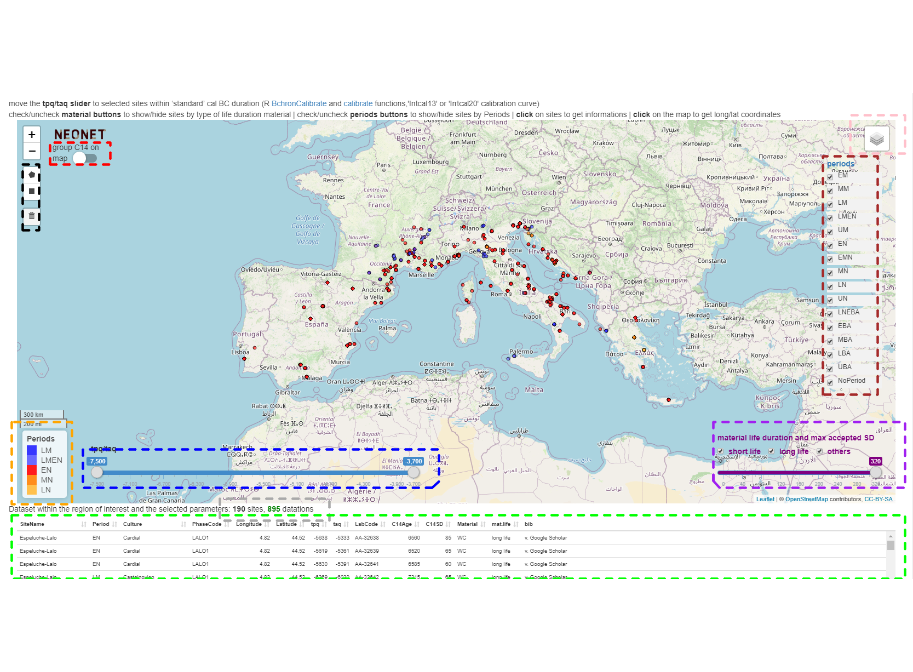

# **Presentation**

The **NeoNet app** allows the selection of radiocarbon dating by location, chronology and material life duration by subsetting a radiocarbon dataset according to: 

* a geographical region of interest (ROI) and a selection shape
* a time span between a *tpq* and a *taq* in cal BC
* some periods
* some type of material life duration (short like, long life or others)
* a maximum accepted standard deviation threshold (SD)

  the [**NeoNet app**](https://neolithic.shinyapps.io/neonet/)  
[/Documents/C14/docs/imgs/panel_map.png){width=50%}](https://neolithic.shinyapps.io/neonet/)

  

We will see how to use the [**NeoNet app**](#app), what is the [**NeoNet database**](#bd) and how to [**participate**](#particip) to the developments of these tools

# Use **NeoNet** {#app}

The apps are [RShiny](https://shiny.rstudio.com/) have the same functionalities. The app is divided into 4 panels:

* [**map** panel](#panel.map): ROI with selection menus
* [**calib** panel](#panel.calib): calibration of the selected dates
* [**data** panel](#panel.data): the whole dataset
* [**infos** panel](#panel.infos): handbook and credits

The two main panels are **map** and **calib**

## **map** panel {#panel.map}
/Documents/C14/docs/imgs/panel_map_idx.png){width=15%}
  
 
The panel **map** is a geographical window provided by the [Leaflet](https://rstudio.github.io/leaflet/) package. This panel is used for selection of radiocarbon dates [by location](#panel.map.select.loc), [by chronology](#panel.map.select.chr), [by quality of dates](#panel.map.select.quali) 

(\#fig:panel-map1)The different menus of the map panel

  
  
The top-left button ***group C14 on map*** (Fig. \@ref(fig:panel-map1), <u>red</u> box), allows to cluster dates by spatial proximities (see [Marker Clusters](http://rstudio.github.io/leaflet/markers.html)). The top-right layer button (Fig. \@ref(fig:panel-map1), <u>pink</u> box), allows to change the basemap. By default, the basemap is **OSM**, an [OpenStreetMap general basemap](https://leaflet-extras.github.io/leaflet-providers/preview/#filter=OpenStreetMap.Mapnik) , but it can be switch to **Topo**, an [ESRI topographical basemap](https://leaflet-extras.github.io/leaflet-providers/preview/#filter=Esri.WorldImagery).

The count of selected dates and sites (Fig. \@ref(fig:panel-map1), <u>grey</u> box) is dynamically calculated below the [tpq/taq slider](#panel.map.tapq) and above the bottom table of the selected dates. This table (Fig. \@ref(fig:panel-map1), <u>green</u> box) is a reactive a datatable (see [DT package](https://cran.r-project.org/web/packages/DT/index.html)) listing all the dates within the map extent (ROI) and the optional selection menus (tpq/taq, material life duration, maximum SD, periods, selection shapes).
  
To calibrate one or various dates in the [**calib** panel](#panel.calib), a date has to be clicked in this panel

/Documents/C14/docs/imgs/panel_map_select.png){width=250px}

This date will be shown **bolded** on the [**calib** panel](#panel.calib) output figure

### select by location {#panel.map.select.loc}

By default only the data within the window extent (ROI) will be selected, but a spatial intersection, inside this ROI with selection shapes, can be done by drawing shapes 

/Documents/C14/docs/imgs/panel_map_shape.png){width=600px}

Selection shapes can be ***polygons*** and ***rectanges***. These shapes can be removed with the trash button (Fig. \@ref(fig:panel-map1), <u>black</u> box). All the dates inside the ROI and selected with the others filters will be visible on the map, but only those inside the selections shapes will be calibrated.

#### retrieve coordinates from the map

The default basemap of the app is OSM. It offers a well documented basemap where archaeological sites are sometimes already located, like the Ligurian site of [Grotta della Pollera](https://www.openstreetmap.org/#map=19/44.20058/8.31466). Clicking on the NeoNet app map show the lat/long coordinates of the current point (under the tpq/tap slider). These coordinates can then be copied and used to modify the NeoNet database

/Documents/C14/docs/imgs/panel_map_coords.png){width=350px}

### select by chronology {#panel.map.select.chr}

#### periods *filter*

Top-right checkboxes (Fig. \@ref(fig:panel-map1), <u>brown</u> box) allow to select datations by periods. A hyperlink on the title of the checkboxes open the [correspondance table](https://htmlpreview.github.io/?https://github.com/zoometh/C14/blob/main/docs/period_abrev.html) between abrevations and period full names. Bottom-left legend **periods** (Fig. \@ref(fig:panel-map1), <u>orange</u> box) is a dynamic list of periods which exist in the selected periods (see **periods** checkboxes)

#### tpq/taq *filter* {#panel.map.tapq}

bottom-left slider (Fig. \@ref(fig:panel-map1), <u>blue</u> box) allows to subset a range of accepted dates between a *tpq* and a *taq* (in cal BC) 

### select by dates quality {#panel.map.select.quali}

The bottom-right checkboxes and slider (Fig. \@ref(fig:panel-map1), purple box) form a group of menus for selection on the material life duration and max accepted SD:

* relatively to the duration of their material (short to long-life material). An hyperlink open the [correspondance table](https://htmlpreview.github.io/?https://github.com/zoometh/C14/blob/main/docs/material_life.html) between the classes of the material life duration (short, long, etc.) and their material (wood, shell, etc.) categories  

* below a maximum accepted threshold for the standard deviations (SD) for the dates

## **calib** panel {#panel.calib}
/Documents/C14/docs/imgs/panel_calib_idx.png){width=15%}

The panel **calib** is used for dates on-the-fly calibration with the R packages [Bchron](https://cran.r-project.org/web/packages/Bchron/index.html) and [rcarbon](https://cran.r-project.org/web/packages/rcarbon/index.html). Calibrations are done on the whole dataset of dates displayed in the [table of the **map panel**](#panel.map). If the dates are numerous (eg > 100) the computing time could take times.

### c14 group by *filter*

The only selection which can be done is on the top-center radio button  (Fig. \@ref(fig:panel-calib), <u>red</u> box). The **c14 group by** filter allows to plot dates and to sum their probability densities depending on different levels of grouping:

* **by date**: each date is plot separeltly (by default)

* **by site and layer**: dates from the same site, having the same archaeological unit (layer, structure, etc.), are summed

* **by site and period**: dates from the same site, having the same period are summed

* **by period**: dates having the same period are summed  

* **all C14**: all dates are summed 

(\#fig:panel-calib)The different menus of the calib panel

### plot area *output*

The plot area (Fig. \@ref(fig:panel-calib), <u>orange</u> box) shows dynamically the SPD of the cabibrated dates seriated on their weighted means. The top-right  button **Download** (Fig. \@ref(fig:panel-calib),, <u>green</u> box) allows to export the last plot in a PNG image

/Documents/C14/docs/imgs/neonet_calib_example.png){width=80%}

## **data** panel {#panel.data}
/Documents/C14/docs/imgs/panel_data_idx.png){width=15%}

The complete database is a datatable ([DT package](https://cran.r-project.org/web/packages/DT/index.html)), with sorting and filtering tools

## **infos** panel {#panel.infos}
/Documents/C14/docs/imgs/panel_infos_idx.png){width=15%}

This webpage is embedded into this panel

# The **NeoNet database** {#bd}

The **NeoNet database** is a collaborative online Google Sheet. The database is composed by 3 spreadsheets: [**c14**](#bd.C14), [**material.life**](#bd.material) and [**period.abrev**](#bd.period)

## Database spreadsheets

### c14 {#bd.C14}
/Documents/C14/docs/imgs/app_neonet_db_c14.png){width=30%}  

This is the complete database. The **mandatory fields** are:

* **SiteName**: the site name
* **Longitude**: in decimal degrees (ex: `1.045`)
* **Latitude**: in decimal degrees (ex: `43.921`)
* **Period**: a value from the [**period.abrev**](#bd.period) spreadsheet
* **C14Age**: a numerical radiocarbon dating in BP
* **C14SD**: the standard deviation of the radiocarbon dating
* [**LabCode**](#mf.labcode): the unique identifier of the radiocarbon dating
* **Material**: a value from the [**material.life**](#bd.material) spreadsheet 
* **tpq**: the *terminus post quem* of the radiocarbon dating in cal BC
* **taq**: the *terminus ante quem* of the radiocarbon dating in cal BC

The **recommended** fields are:

* **PhaseCode**: a code for the dating stratigaphical unit and/or structure
* **bib**: a plain text bibliographical reference
* **bib_url**: the current URL of the reference or its notice 
* **MaterialSpecies**: a specification of the field **Material**
* **Culture**: a specification of the field **Period**

The others fields only concern the **[EUROEVOL_R app](https://zoometh.github.io/C14)** 

#### mandatory fields

All these fields are needed to make app working

##### **LabCode** {#mf.labcode}

The correct syntax for a laboratory code (**LabCode**) is '*AbrevLab*-*number*'. For example:

<table class="table" style="font-size: 12px; width: auto !important; margin-left: auto; margin-right: auto;">
 <thead>
  <tr>
   <th style="text-align:left;"> LabCode </th>
  </tr>
 </thead>
<tbody>
  <tr>
   <td style="text-align:left;"> Beta-103487 </td>
  </tr>
  <tr>
   <td style="text-align:left;"> CSIC-1133 </td>
  </tr>
  <tr>
   <td style="text-align:left;"> ETH-15984 </td>
  </tr>
  <tr>
   <td style="text-align:left;"> Gif-1855 </td>
  </tr>
  <tr>
   <td style="text-align:left;"> KIA-21356 </td>
  </tr>
  <tr>
   <td style="text-align:left;"> LTL-13440A </td>
  </tr>
  <tr>
   <td style="text-align:left;"> Ly-11338 </td>
  </tr>
  <tr>
   <td style="text-align:left;"> MC-2145 </td>
  </tr>
  <tr>
   <td style="text-align:left;"> OxA-9217 </td>
  </tr>
  <tr>
   <td style="text-align:left;"> Poz-18393 </td>
  </tr>
  <tr>
   <td style="text-align:left;"> ... </td>
  </tr>
</tbody>
</table>

### material.life {#bd.material}
{width=30%}

The two fields show the material type and the material life duration, for example: 

<table class="table" style="font-size: 12px; width: auto !important; margin-left: auto; margin-right: auto;">
 <thead>
  <tr>
   <th style="text-align:left;"> material.type </th>
   <th style="text-align:left;"> life.duration </th>
  </tr>
 </thead>
<tbody>
  <tr>
   <td style="text-align:left;"> bone </td>
   <td style="text-align:left;"> short life </td>
  </tr>
  <tr>
   <td style="text-align:left;"> seed </td>
   <td style="text-align:left;"> short life </td>
  </tr>
  <tr>
   <td style="text-align:left;"> wood </td>
   <td style="text-align:left;"> long life </td>
  </tr>
  <tr>
   <td style="text-align:left;"> ... </td>
   <td style="text-align:left;"> ... </td>
  </tr>
</tbody>
</table>

You can also [see the entire dataframe ](https://htmlpreview.github.io/?https://github.com/zoometh/C14/blob/main/docs/material_life.html)

### period.abrev {#bd.period}
{width=30%}

The two fields show the period abreviation and the period full label, for example:

<table class="table" style="font-size: 12px; width: auto !important; margin-left: auto; margin-right: auto;">
 <thead>
  <tr>
   <th style="text-align:left;"> period.abrev </th>
   <th style="text-align:left;"> period </th>
  </tr>
 </thead>
<tbody>
  <tr>
   <td style="text-align:left;"> LM </td>
   <td style="text-align:left;"> Late Mesolithic </td>
  </tr>
  <tr>
   <td style="text-align:left;"> LMEN </td>
   <td style="text-align:left;"> Late Mesolithic/Early Neolithic </td>
  </tr>
  <tr>
   <td style="text-align:left;"> EN </td>
   <td style="text-align:left;"> Early Neolithic </td>
  </tr>
  <tr>
   <td style="text-align:left;"> ... </td>
   <td style="text-align:left;"> ... </td>
  </tr>
</tbody>
</table>

You can also [see the entire dataframe ](https://htmlpreview.github.io/?https://github.com/zoometh/C14/blob/main/docs/period_abrev.html)

# How to **participate** {#particip}

Thanks to the facilities offer by the app, and in the frame of the **[NeoNet project](https://redneonet.com)**, conducted by [Juan Gibaja](https://orcid.org/0000-0002-0830-3570) and [Miriam Cubas](https://orcid.org/0000-0002-2386-8473), we expect to conduct collaborative spatio-temporal analysis for the origin, the spread and the consolidation of the farming way-of-life in Mediterranean. As data came from various publications:

* an homogenisation the different values (material, cultures, etc.) must be done
* every radiocarbon dating should be carefully referenced with a bibliographical reference in BibTeX format

Contact <nicco.mazzucco@gmail.com> for database and data integration

## Short-term objectives {#next.publish}

Today, the **NeoNet app** release is online. At the short-term, and in the frame of [**FAIR** Open Science principles](https://www.go-fair.org/fair-principles/) (*Findable*, *Accessible*, *Interoperable* & *Reusable*), we plan to:

* publish the **NeoNet database** in a Open Data repository (ex: [Zenodo](https://zenodo.org/))
* publish the **NeoNet database** reference in a data paper (ex: [JOAD](https://openarchaeologydata.metajnl.com/))
* publish the RShiny **NeoNet app** source code in a Open digital humanities paper (ex: [JOSS](https://joss.theoj.org/))
* publish the archaeological result(s) in scientific paper(s) (*journal to be defined*)
* present the results and the app in conferences, seminars, etc.

## Mid-term objectives {#next.server}

Today the **NeoNet app** is hosted on the [**shinyapps.io**](https://www.shinyapps.io/) server, an opensource but limited solution. For example, no direct connection can be done between the app and the database (ie the Google Sheet), so the app have to be *pushed* regularly on the **shinyapps.io** server after the database have been updated. After publishing the various facets of this work (see [short-term objectives](#next.publish)), we plan to host the new releases of the app/database on a R server hosted in a research institution (University, Laboratory) and to developp a *real* database on [PostgreSQL/PostGIS](https://www.postgresql.org/) integrating other *proxys* in addition to radiocarbon dates

Contact <thomashuet7@gmail.com> for app updates
